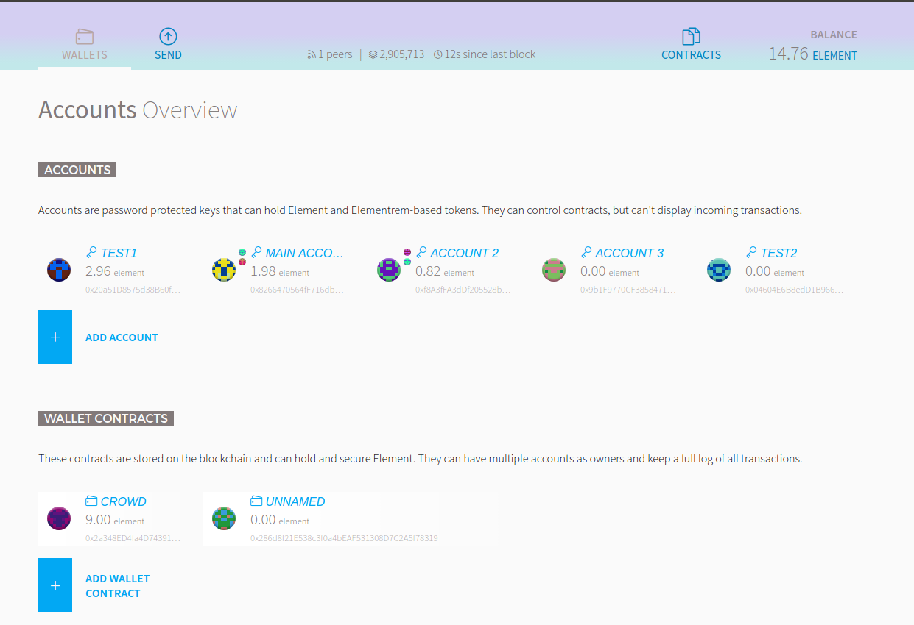

# Elementrem Wallet Ðapp

The Elementrem meteor dapp wallet.

**NOTE** 
The wallet is not yet official released, can contain severe bugs!

Meteor wallet is vulnerable to rpc attack. recommend the mist wallet.

Create New Account button is supported in the mist wallet.

## Development

Start an `gele` node and and the app using meteor and open http://localhost:3000 in your browser:

    $ gele --rpccorsdomain "http://localhost:3000" --rpc --unlock <your account>

Starting the wall dapp using [Meteor](http://meteor.com/install)

    $ cd meteor-dapp-wallet/app
    $ meteor --port<default 3000>

Go to http://localhost:3000

